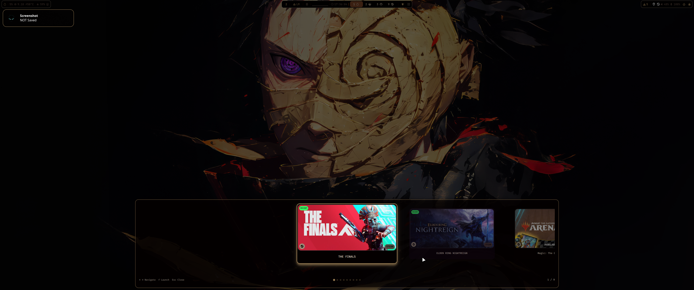

# Quickshell Launchers

Collection de launchers Quickshell pour Hyprland avec intégration pywal/wallust.



## 📦 Projets

### 🎮 Game Launcher
Launcher de jeux avec support multi-plateformes et interface élégante.


**Fonctionnalités:**
- 🎯 Support Steam, jeux non-Steam, Heroic (Epic/GOG/Amazon), et jeux manuels
- 🎮 Détection automatique des jeux non-Steam ajoutés à Steam (via shortcuts.vdf)
- 🖼️ Couvertures automatiques depuis Steam/SteamGridDB
- 🏷️ Badges de plateforme et catégories
- ⭐ Système de favoris
- 🆕 Indicateurs NEW/RECENT
- 🎨 Thème pywal/wallust automatique
- ⌨️ Navigation clavier et molette
- 📚 Vue bibliothèque avec chemins d'installation

**Contrôles:**
- Rechercher un jeu...
- `←` `→` : Navigation
- `Enter` : Lancer le jeu
- `Double-clic` : Lancer le jeu
- `Esc` : Fermer
- `Molette` : Naviguer

### 🌈 RGB Launcher
Contrôleur OpenRGB avec 8 séquences d'animation + couleurs fixes.


**Séquences:**
1. 🌊 **Ocean Wave** - Vague océanique fluide
2. 🔥 **Fire Dance** - Flammes dansantes
3. 🌲 **Forest Breath** - Respiration de forêt
4. 🌸 **Cherry Blossom** - Pétales de cerisier
5. 💻 **Matrix Rain** - Pluie Matrix style
6. 🌌 **Aurora Borealis** - Aurore boréale
7. ⚡ **Lightning Storm** - Orage électrique
8. 🌃 **Neon City** - Ville néon cyberpunk

**Couleurs fixes:**
Rouge, Vert, Bleu, Cyan, Magenta, Jaune, Blanc, Orange, Violet, Rose, Lime, Azure

## 🛠️ Installation

### Prérequis

```bash
# Arch Linux
sudo pacman -S python qt6-declarative python-openrgb python-watchdog

# Bibliothèque VDF pour Steam (jeux non-Steam)
pip install vdf

# Quickshell
yay -S quickshell-git

# Font Awesome 7 (pour les icônes)
yay -S ttf-font-awesome-7
```

### Configuration

#### Game Launcher

1. **Configurer Steam:**
```toml
# game-launcher/config.toml
[steam]
enabled = true
library_paths = [
    "~/.local/share/Steam/steamapps",
    "/mnt/games/Steam/steamapps",  # Ajoutez vos chemins
]
Optionnel Steamgrid si clef Api:
api_key = ""
```

2. **Configurer Heroic:**
```toml
[heroic]
enabled = true
config_paths = [
    "~/.config/heroic",
    "~/.var/app/com.heroicgameslauncher.hgl/config/heroic",  # Flatpak
]
scan_epic = true
scan_gog = true
scan_amazon = true
scan_sideload = true
```

3. **Ajouter des jeux manuels:**
```toml
# game-launcher/games.toml
[[games]]
name = "Mon Jeu"
exec = "chemin/vers/jeu"
image = "~/Pictures/games/mon-jeu.png"
category = "fps"
favorite = true
```

3. **Script de lancement du quikshell game:**

    ~/.config/quickshell/game-launcher/toggle.sh

Hyprland key:

    bind = SUPER, G, exec, ~HOME/.config/quickshell/game-launcher/toggle.sh


5. **Créer le dossier box-art:**
```bash
mkdir -p ~/.config/quickshell/game-launcher/box-art
```

#### RGB Launcher

1. **Installer OpenRGB SDK:**
```bash
# OpenRGB doit être lancé avec le serveur SDK activé
# Settings → Enable SDK Server
```

2. **Configurer les modes:**
```toml
# rgb-launcher/config.toml
[[modes]]
name = "Ocean Wave"
command = "python3 /home/USER/.config/hypr/Openrgb/OpenRGB_Controller.py sequence_1"
icon = "\uf773"
icon_font = "Font Awesome 7 Free Solid"
category = "sequences"
```

## 🎨 Thème Pywal/Wallust

Les launchers s'intègrent automatiquement avec pywal/wallust.

**Fichier de couleurs:** `~/.cache/wal/wal.json`

**Couleurs utilisées:**
- `background` : Fond principal
- `foreground` : Texte
- `color0-15` : Badges, bordures, effets

## 🚀 Utilisation

### Game Launcher

```bash
# Lancer depuis Quickshell
quickshell game-launcher/GameLauncher.qml

# Voir la bibliothèque complète
python3 game-launcher/list_games.py
```

### RGB Launcher

```bash
# Lancer depuis Quickshell
quickshell rgb-launcher/RGBLauncher.qml

# Contrôle direct
python3 /path/to/OpenRGB_Controller.py sequence_1
python3 /path/to/OpenRGB_Controller.py fixed_rouge
python3 /path/to/OpenRGB_Controller.py off
```

## 📁 Structure du Projet

```
quickshell/
├── game-launcher/
│   ├── backend.py              # Scan jeux Steam/Heroic/manuels
│   ├── list_games.py           # Affiche bibliothèque + chemins
│   ├── GameCard.qml            # Composant carte de jeu
│   ├── GameLauncher.qml        # Interface principale
│   ├── config.toml             # Configuration
│   ├── games.toml              # Jeux manuels
│   └── box-art/                # Couvertures
│
├── rgb-launcher/
│   ├── backend.py              # Backend RGB
│   ├── RGBLauncher.qml         # Interface RGB
│   └── config.toml             # Configuration RGB
│
└── README.md
```

## 🎯 Fonctionnalités Techniques

### Game Launcher
- **QML/Qt6** - Interface moderne avec MultiEffect
- **Python 3.11+** - Backend avec tomllib
- **Layer Masking** - Coins arrondis natifs sur images
- **Carousel horizontal** - Navigation fluide avec animations
- **ACF Parsing** - Extraction chemins Steam
- **VDF Binary Parsing** - Détection jeux non-Steam via shortcuts.vdf
- **AppID Conversion** - Conversion correcte des AppID Steam pour lancement
- **JSON Parsing** - Support Heroic Games Launcher

### RGB Launcher
- **OpenRGB Python SDK** - Contrôle RGB
- **Animations multi-phases** - Effets complexes
- **Interpolation couleurs** - Transitions fluides
- **Threading** - Animations asynchrones

## 🤝 Contribution

Contributions bienvenues! N'hésitez pas à:
- Signaler des bugs
- Proposer des améliorations
- Ajouter des séquences RGB
- Améliorer la documentation

## 📝 Licence

MIT License - Libre d'utilisation et modification

## 🙏 Crédits

- **Quickshell** - Framework QML pour Wayland
- **OpenRGB** - Contrôle RGB universel
- **pywal/wallust** - Génération de palettes
- **Font Awesome** - Icônes
- **Steam/Heroic** - Plateformes de jeux

---

**Auteur:** Florian
**Version:** 1.0.0
**Date:** 2025
